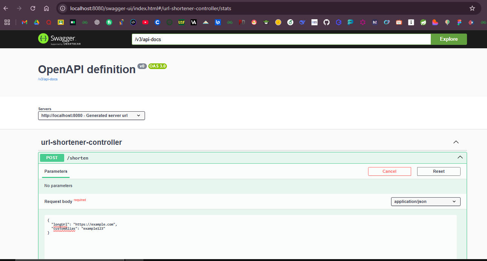
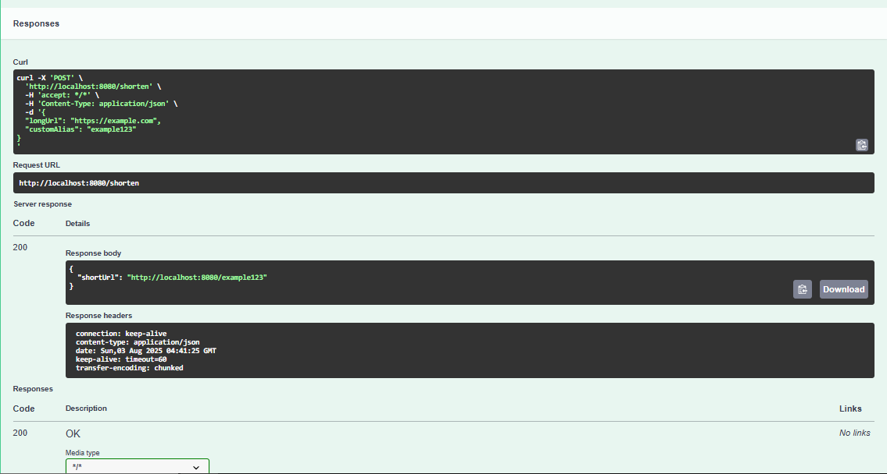
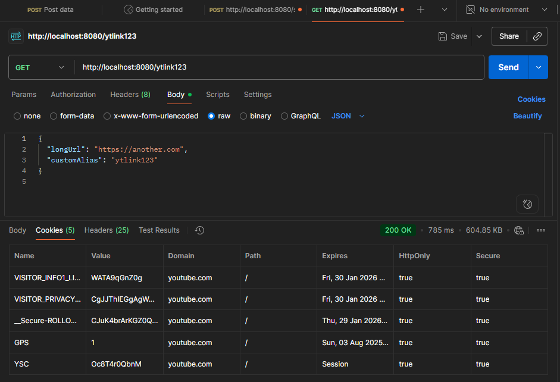
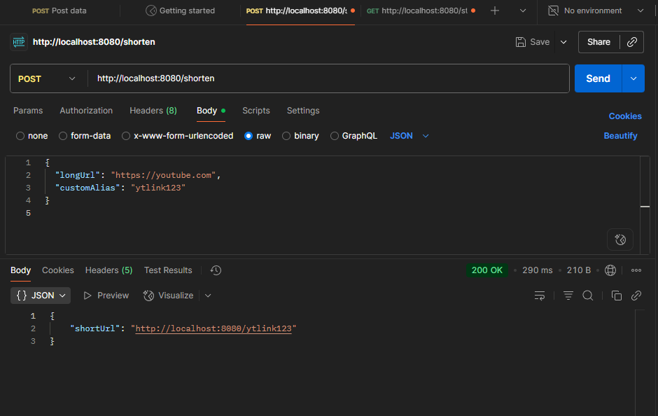
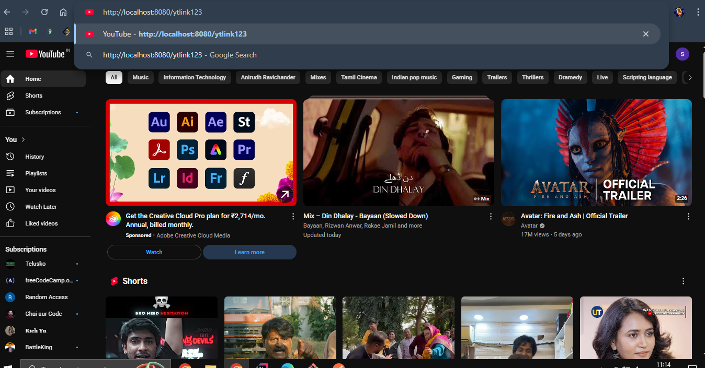

# 🔗 URL Shortener - Spring Boot Project

A simple yet powerful **URL Shortener API** built using **Java 17**, **Spring Boot**, and **Spring Data JPA**.  
This project provides a mini URL shortener like Bitly, with bonus features such as custom alias support and Swagger UI for documentation.

---

## 🚀 Features

- ✅ Shorten long URLs
- ✅ Optional custom alias support
- ✅ Redirection to original URL
- ✅ Statistics (creation time + access count)
- ✅ Swagger UI documentation
- ✅ Bonus: Custom alias & Swagger integrated

---

## 🛠 Tech Stack

- Java 17
- Spring Boot 3
- Spring Data JPA (Hibernate)
- H2 (in-memory database)
- Lombok
- Swagger UI (`springdoc-openapi`)

---

## 📂 Project Structure

---

## Tech Stack

- **Java 17**
- **Spring Boot 3**
- **Spring Data JPA (Hibernate)**
- **H2 Database** (in-memory; switchable to MySQL if needed)
- **Lombok**
- **Swagger UI** via `springdoc-openapi`

---

## Project Structure: 

url-shortener/
├── pom.xml
├── README.md
└── src
├── main
│ ├── java/com/example/urlshortener
│ │ ├── controller
│ │ │ └── UrlShortenerController.java
│ │ ├── dto
│ │ │ ├── UrlRequest.java
│ │ │ └── UrlResponse.java
│ │ ├── entity
│ │ │ └── UrlMapping.java
│ │ ├── repository
│ │ │ └── UrlMappingRepository.java
│ │ ├── service
│ │ │ └── UrlShortenerService.java
│ │ └── UrlShortenerApplication.java
│ └── resources
│ ├── application.properties
│ └── (other resource files)
└── test
└── java/com/example/urlshortener
└── DemoApplicationTests.java

---

## ▶️ How to Run the App

### Option 1: Via Terminal

bash:
  git clone https://github.com/tech-shrii/url-shortener.git
  cd url-shortener
  ./mvnw spring-boot:run
  
  ### Option 2: Via IDE (Eclipse / IntelliJ)
  Import the Maven project
  Run UrlShortenerApplication.java

2. **Access the Application:**

    The app will start at: http://localhost:8080
    
    3. Testing with Swagger UI:
    
    Open your browser and visit:
    
    http://localhost:8080/swagger-ui/index.html

## API Documentation
1. POST /shorten
    Description: Create a short URL from a long URL. Optionally, include a custom alias.
    
    Request Body:
    json input:
    
    {
      "longUrl": "https://www.example.com/very/long/link",
      "customAlias": "customlink"  // This field is optional if u dont add this custome link automatically generate
    }
    Response Example:
    json output:
    {
      "shortUrl": "http://localhost:8080/customlink"
    }
   
2.GET /{shortCode}
    Description: Redirects to the original URL using the provided short code.
    Example:
    URL: http://localhost:8080/customelink
    
    Response: Redirect with HTTP status 302 to the original URL.

3. GET /stats/{shortCode}
    Description: Retrieves statistics for a given short URL.
    Example:
    URL: http://localhost:8080/stats/customelink
    
    Response Example:
    json output:
    {
      "originalUrl": "https://www.example.com/very/long/link",
      "createdAt": "2025-08-02T15:23:01",
      "accessCount": 1
    }

4. Bonus Features Implemented
    Custom Alias Support: Users can optionally specify a custom alias when creating a short URL.
    Swagger UI Integration: Provides an interactive interface for API testing and documentation.

## 📸 Screenshots

### ✅ Swagger UI Demo

### ✅ Postman Test Result

### ✅ URL Redirection in Browser

👤 Author
Shrikant Ingle
GitHub: tech-shrii
       
